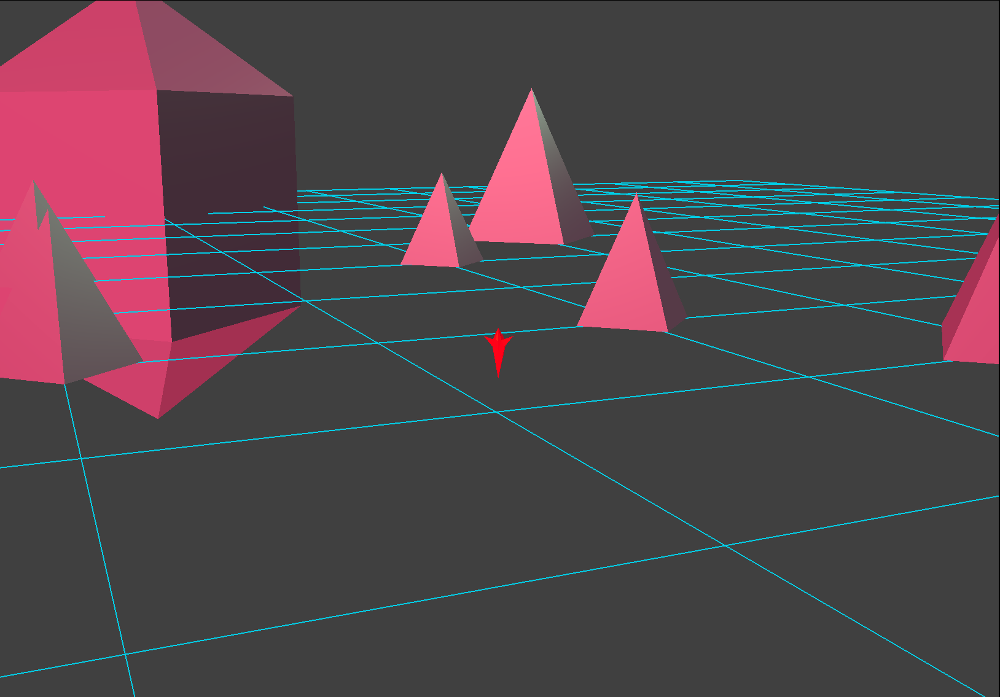
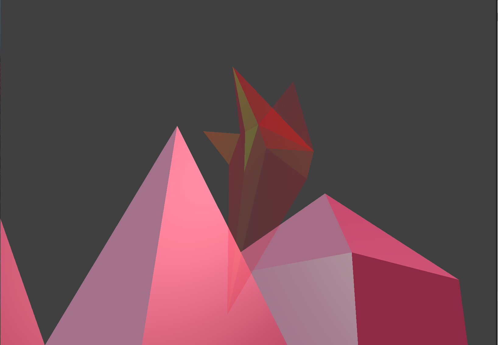
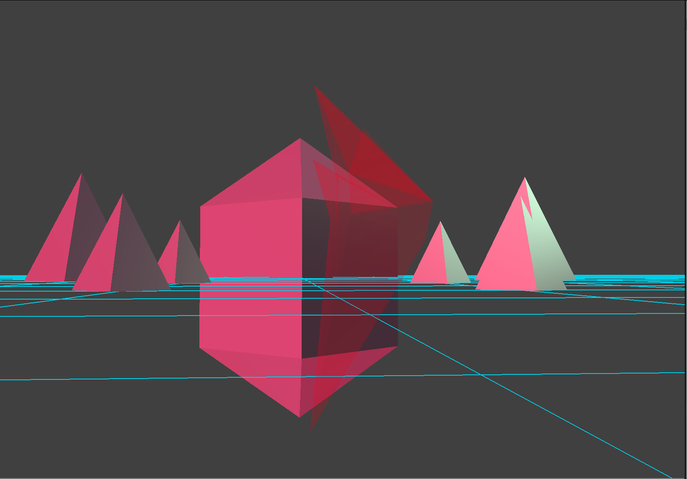
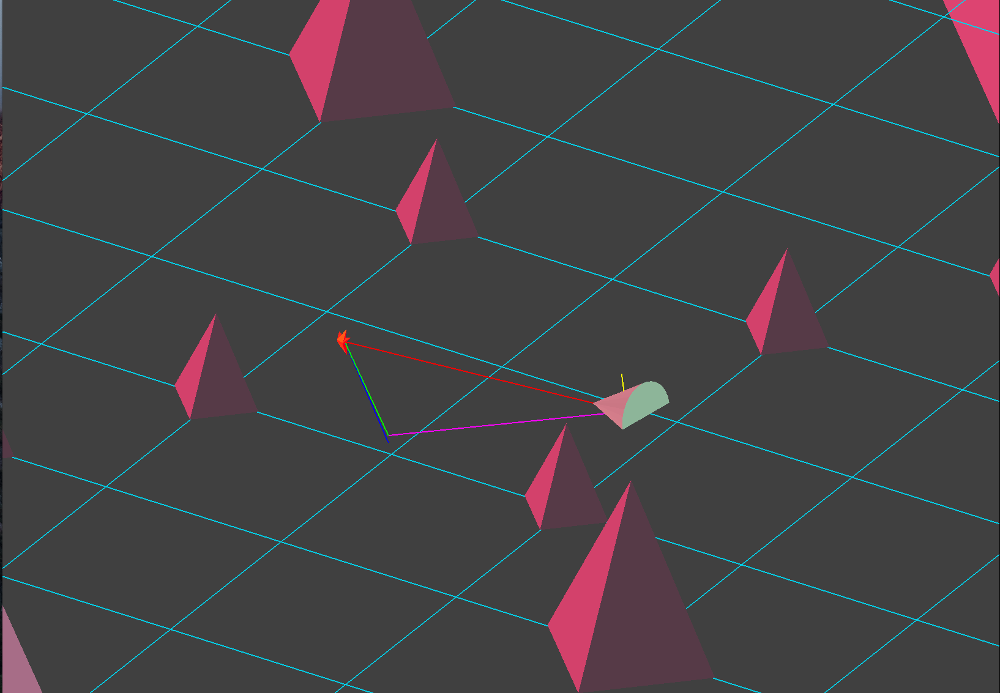

# Fil's Third Person Camera

Welcome to *Fil's Third Person Camera*.

You can also find the project in [BlendSwap.com](http://www.blendswap.com/blends/view/81711).

**Featuring:**

- Smooth motion;
- Control angle with mouse and distance with mouse wheel (customisable);
- Adjustable camera parameters;
- Wall detection;
- Easy to set up;
- Camera sensitive material (transparency);
- Debug option (see camera behaviour from editor viewport).

Tweak the camera parameters in section "Camera parameters" in script *DynamicCamera.py*, that you can find in the dropdown menu at the left of *README* at the bottom.

You can see the behaviour of the camera from the editor viewport by setting `debugState = 1` under section `Debug variable` of script *DynamicCamera.py*.

## Usage

Hit P and enjoy!

**Controls:** WASD to move, mouse to rotate the camera and mouse wheel to adjust the camera distance.

## Import the camera script in your project

1. Copy the camera in the second layer and the mesh in the third layer of this project to some layers of your project;
2. Create an empty in your project in the scene where you want the camera and attach to it the script *DynamicCamera.py*, that you can find in the Text Editor of the [example project](FilsThirdPersonCamera.blend) or [here](DynamicCamera.py). The blend file was tested with Blender 2.76.

 

 

	|	
:---------------------:|:------------------------:
  |  